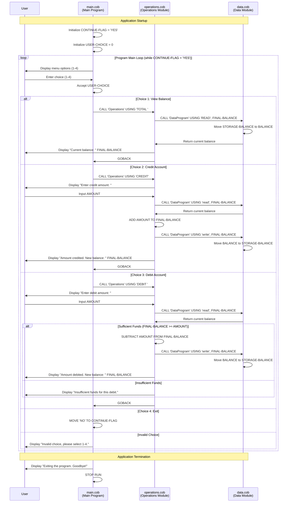

# COBOL Student Account Management System

## Overview

This legacy COBOL application provides a simple student account management system with basic banking functionality. The system allows users to view account balances, credit funds, and debit funds while maintaining data persistence through a modular architecture.

## System Architecture

The application follows a modular design pattern with three main components:

1. **Main Program** (`main.cob`) - User interface and program flow control
2. **Operations Module** (`operations.cob`) - Business logic and transaction processing  
3. **Data Module** (`data.cob`) - Data storage and retrieval operations

## File Documentation

### main.cob - Main Program Controller

**Purpose**: Entry point for the application that provides the user interface and manages program flow.

**Key Functions**:

- `MAIN-LOGIC`: Main program loop that displays menu options and processes user selections
- Menu-driven interface with options for:
  - View Balance (Option 1)
  - Credit Account (Option 2)
  - Debit Account (Option 3)
  - Exit (Option 4)

**Data Elements**:

- `USER-CHOICE`: Single digit to store user menu selection (1-4)
- `CONTINUE-FLAG`: Controls the main program loop ('YES'/'NO')

**Business Rules**:

- Input validation ensures only valid menu options (1-4) are processed
- Invalid selections display error message and re-prompt user
- Program continues until user explicitly chooses to exit

### operations.cob - Transaction Processing Module

**Purpose**: Handles all account transaction operations including balance inquiries, credits, and debits.

**Key Functions**:

- **Balance Inquiry** (`TOTAL`): Retrieves and displays current account balance
- **Credit Transaction** (`CREDIT`): Adds funds to the account
- **Debit Transaction** (`DEBIT`): Withdraws funds from the account with overdraft protection

**Data Elements**:

- `OPERATION-TYPE`: 6-character field to identify the requested operation
- `AMOUNT`: Numeric field (6 digits + 2 decimal places) for transaction amounts
- `FINAL-BALANCE`: Current account balance with default value of $1,000.00

**Business Rules**:

- **Credit Transactions**: No limit on credit amounts
- **Debit Transactions**:
  - Insufficient funds protection - transaction denied if debit amount exceeds balance
  - Balance must be greater than or equal to debit amount
- **Balance Display**: Shows current balance with proper decimal formatting
- All transactions update the persistent balance through the data module

### data.cob - Data Storage Module

**Purpose**: Manages data persistence and provides read/write operations for account balance.

**Key Functions**:

- **READ Operation**: Retrieves current balance from storage
- **WRITE Operation**: Updates stored balance with new value

**Data Elements**:

- `STORAGE-BALANCE`: Persistent balance storage with initial value of $1,000.00
- `OPERATION-TYPE`: Operation identifier ('READ' or 'WRITE')

**Business Rules**:

- **Data Persistence**: Balance is maintained in memory throughout program execution
- **Initial Balance**: New accounts start with $1,000.00 default balance
- **Data Integrity**: All balance updates must go through this module

## Student Account Business Rules

### Account Management

- **Initial Balance**: All student accounts begin with a default balance of $1,000.00
- **Balance Format**: All monetary values are stored with 2 decimal places precision
- **Maximum Balance**: System supports balances up to $9,999.99

### Transaction Rules

- **Credit Transactions**:
  - No maximum limit on credit amounts
  - Credits are immediately reflected in account balance
  - Positive amounts only (input validation at user interface level)

- **Debit Transactions**:
  - Overdraft protection prevents negative balances
  - Transaction denied if insufficient funds
  - Debit amount cannot exceed current balance
  - Clear error messaging for failed transactions

### Data Validation

- **Menu Input**: Only accepts values 1-4 for menu navigation
- **Monetary Input**: Accepts numeric values with optional decimal places
- **Operation Types**: Strict validation of operation codes ('READ', 'WRITE', 'TOTAL', 'CREDIT', 'DEBIT')

## System Flow

1. **Program Start**: Main program initializes with default settings
2. **Menu Display**: User presented with available options
3. **User Selection**: Input validated and appropriate operation called
4. **Transaction Processing**: Operations module handles business logic
5. **Data Access**: Data module manages balance storage and retrieval
6. **Result Display**: Transaction results shown to user
7. **Loop Continue**: Return to menu unless user chooses to exit

## Technical Notes

- **Program Communication**: Uses COBOL CALL statements for inter-program communication
- **Parameter Passing**: USING clause passes parameters between modules
- **Data Types**:
  - `PIC 9(6)V99` for monetary values (up to 999,999.99)
  - `PIC X(6)` for operation codes
  - `PIC X(3)` for flags and short text
- **Error Handling**: Basic validation with user-friendly error messages

## Future Modernization Considerations

- Replace in-memory storage with persistent database
- Add user authentication and multi-account support
- Implement transaction history and reporting
- Add input validation for monetary amounts
- Consider web-based or API interface for modern integration
- Add audit logging for all transactions
- Implement proper error handling and recovery mechanisms

## System Data Flow Diagram

The following sequence diagram illustrates the data flow and interactions between the three main components of the COBOL student account management system:

### Diagram Key Points

- **User Interaction**: All user inputs and system outputs are clearly shown
- **Module Communication**: COBOL CALL statements are represented as messages between modules
- **Data Flow**: Shows how balance data flows between the operations and data modules
- **Business Logic**: Conditional logic for insufficient funds is illustrated
- **Program Flow**: The main loop structure and exit conditions are depicted
- **Error Handling**: Invalid menu choices and insufficient funds scenarios are included

This diagram provides a comprehensive view of how the three COBOL programs interact to provide the complete student account management functionality.
